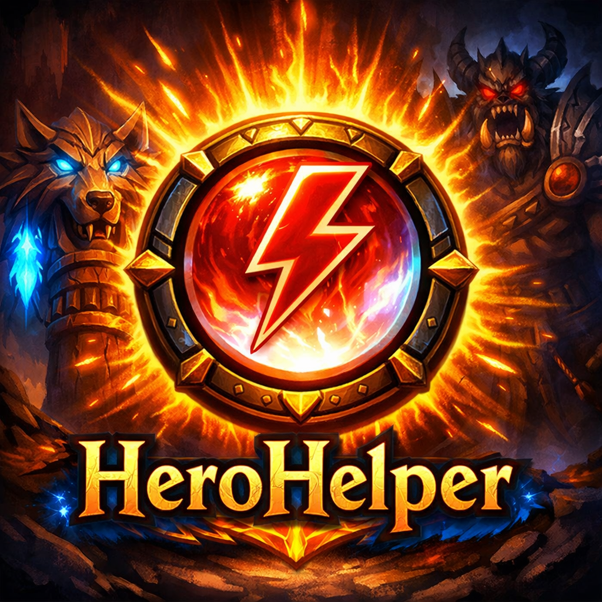
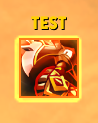
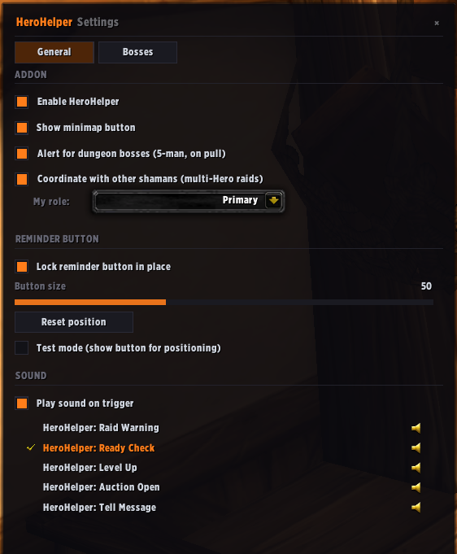
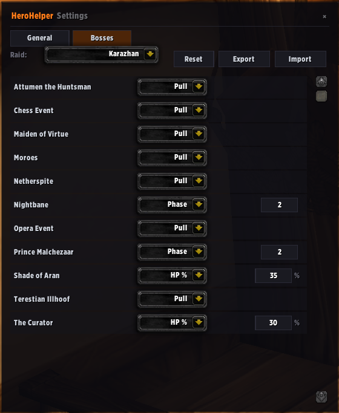

## HeroHelper

A simple TBC Classic Anniversary addon that tells Shamans **when** to cast Heroism / Bloodlust on every raid and dungeon boss.

 

No more checking the spreadsheet between pulls. No more "wait, was I supposed to lust this one?". A glowing reminder pops up at the right moment — you press your keybind, you cast, you keep DPS'ing.

*The reminder pops up when it's time to cast. Press the key you've bound to the `HeroHelperCast` macro to fire Heroism or Bloodlust.*

---

### What it does

- Watches every raid pull and every dungeon boss.
- Pops a glowing reminder at the moment your raid wants Heroism — on the pull, at a specific HP%, when a phase starts, after a set time, or any combination.
- Stays out of your way the rest of the time. Hidden until needed, fades out after the cast.
- Creates a per-character `HeroHelperCast` macro you bind to any key you like — casting happens via your keybind, not by clicking the reminder. Combat-safe, no click-through risk.
- Knows about every boss in **all nine TBC raids** and **every TBC 5-man dungeon**, with researched defaults out of the box.
- Coordinates with **other shamans in your group** so two of you don't waste a Heroism on the same pull.

---

### How to use it

**1. Install.** Drop the `HeroHelper` folder into `Interface/AddOns/`, or grab the latest release from CurseForge.

**2. Bind your cast key.** On first login the addon creates a macro named **`HeroHelperCast`** in your per-character macro list. Go to **Escape → Key Bindings → Macros**, find `HeroHelperCast`, and bind any key you want (e.g. `Shift+Z`). That's the key you'll press when the reminder pops.

**3. Position the reminder.** Type `/hh` to open the options.

- In the **General** tab, choose your sound and (if you raid with another shaman) pick your role: *Primary*, *Secondary*, *Backup*, or *Auto*.
- Type `/hh test` once to show the reminder, drag it where you want it, then `/hh test` again to hide it.

**4. Pick your triggers.** Open the **Bosses** tab.

Each boss has a default trigger that should be sensible for most raids. You can change any of them:

- **Pull** — fires the reminder the moment you engage the boss.
- **HP %** — fires when the boss drops below a chosen HP percentage (good for execute phases).
- **Phase** — fires when the boss enters a specific phase (only for bosses with detectable phase yells).
- **Time** — fires a fixed number of seconds after the pull.
- **Multi** — fires on the *first* of multiple conditions you pick (e.g. *phase 3 or HP 25% or 90 seconds in*).
- **Off** — disable the reminder for this boss entirely.

Click **Export** to copy your settings as a share string and send them to the rest of your raid. They click **Import** and you're synced.

**5. Pull a boss.** When it's time, the reminder pops up. Press your bound key. Done.

---

### Coordinating with other shamans

By default, every HeroHelper-using shaman fires their own reminder. When you want to lock in who Heroes, someone types `/hh roster lock` — that freezes the current roster, announces the resolved order to group chat, and from then on only the elected shaman's reminder fires. If that shaman dies mid-fight, the reminder automatically jumps to the next-priority alive shaman (Primary > Secondary > Backup).

Each shaman sets their **role** in the General tab before the lock:

- **Primary** — elected first when alive.
- **Secondary** — elected if Primary is dead.
- **Backup** — elected if Primary and Secondary are dead.
- **Auto** — no explicit role; alphabetical tiebreak only.

Type `/hh roster unlock` to drop the lock and go back to everyone firing independently. `/hh roster` on its own shows the current state — locked or live, roster contents, and the current elected winner.

---

### Slash commands

| Command | What it does |
|---|---|
| `/hh` | Open the options panel |
| `/hh test` | Show / hide the reminder so you can drag it into position |
| `/hh mobtest` | Test the reminder by targeting any mob (fires when it drops below 50% HP) |
| `/hh mobtest pull` | Test the pull-trigger flow on the next mob you engage |
| `/hh lock` / `/hh unlock` | Lock or unlock the reminder in place |
| `/hh reset` | Move the reminder back to screen center |
| `/hh roster` | Show the current multi-shaman roster and whether it's locked |
| `/hh roster lock` | Freeze the hero order, announce it to the group, suppress non-winners |
| `/hh roster unlock` | Release the lock; every shaman fires independently again |
| `/hh debug` | Toggle verbose chat output (for troubleshooting) |

---

### About the cast

HeroHelper creates a per-character macro called **`HeroHelperCast`** in your macro list. Its body is `/cast [@player] Heroism` (or Bloodlust). You bind a key to this macro **once** in Escape → Key Bindings → Macros, and that key is what you press when the reminder pops.

Why a keybind instead of clicking? Clicking a protected-frame reminder during combat hits TBC 2.5.5's combat-lockdown rules hard and produces click-through bugs (clicks under the hidden reminder can fire Heroism on other unit frames). Delegating the cast to WoW's native macro-keybind system sidesteps all of it — pressing the key works the same in and out of combat, and the reminder is a pure visual indicator with no casting machinery attached.

HeroHelper refreshes the macro body on every login to keep it in sync with your current spell (Heroism vs. Bloodlust) — edits made in WoW's macro editor will be reverted. If you need a different macrotext (e.g. `/stopcasting` prefix, `/use` on an item first, etc.), set `HeroHelperCharDB.settings.macrotext` to your custom body in the saved-variable file and HeroHelper will use that instead.

---

### Compatibility

- **Game version**: TBC Classic Anniversary (2.5.5)
- **Addon version**: 1.3.0
- Works on its own. Plays nicely with **BigWigs** and **DBM** if you have them.

---

### Acknowledgments

Architecture and visual style are aligned with [FishingKit](https://github.com/klopfer-hello/fishingkit-reworked) — same module layout, same flat dark config theme, same self-contained minimap button pattern.

---

### License

MIT — see [LICENSE](LICENSE).
